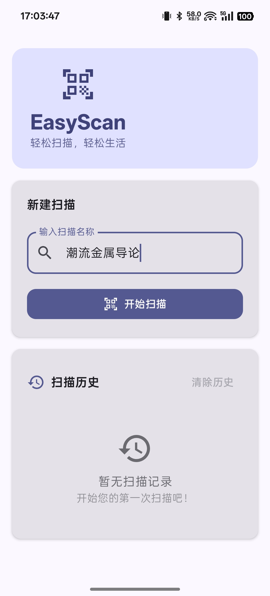
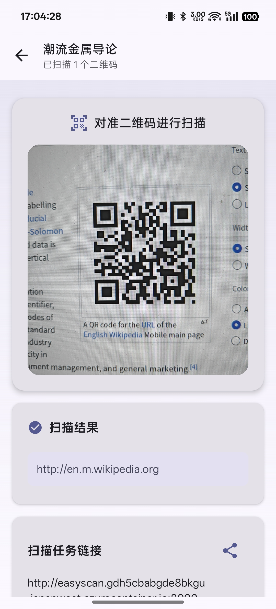

# EasyScan

一个基于Kotlin Multiplatform和Compose Multiplatform构建的跨平台二维码扫描和同步应用，支持Android和Desktop平台。

<div style="display: flex; justify-content: center; gap: 2%;">
  
  
</div>

## 功能特性

- 🔍 二维码扫描功能
- 📱 支持Android和Desktop平台
- 🌐 支持自定义服务器端点配置
- 🎨 Material Design 3界面设计

## 项目结构

* `/composeApp` 包含跨平台共享代码
  - `commonMain` - 所有平台的通用代码
  - `androidMain` - Android平台专用代码
  - `desktopMain` - Desktop平台专用代码
  - `commonTest` - 通用测试代码

## 开发环境要求

- JDK 11 或更高版本
- Android Studio 或 IntelliJ IDEA
- Android SDK (用于Android平台)

## 🔧 配置服务器端点

关于服务端配置，请移步 [EasyScanServer](https://github.com/LiYulin-s/easyscan-server) 仓库。

本应用使用BuildKonfig来管理配置，你可以通过以下方式配置服务器端点：

### 使用本地配置文件

1. 在项目根目录 `local.properties` 修改配置：
```properties
easyscan.url=http://your-server-address:port
```

## 🚀 运行应用

### Android
```bash
./gradlew :composeApp:installDebug
```


## 📦 构建发布版本

### Android APK
```bash
./gradlew :composeApp:assembleRelease
```

## 🤖 GitHub Actions 自动编译（Fork 用户指南）

1. Fork 本仓库到你的账号。
2. 进入你的仓库，点击“Settings” → “Secrets and variables” → “Actions”。
3. 新增一个名为 `EASYSCAN_URL` 的 Repository secret，值为你的服务端地址（如 `https://your-server.com`）。
4. （可选）如需自定义更多配置，可参考 `.github/workflows/build.yml`。
5. Push 或创建 Tag（如 `v1.0.0`），GitHub Actions 会自动编译并在 Release 页面生成 APK。

## 🙏 鸣谢

### 核心技术栈
- **[Kotlin Multiplatform](https://kotlinlang.org/docs/multiplatform.html)** - 跨平台开发框架
- **[Compose Multiplatform](https://www.jetbrains.com/lp/compose-multiplatform/)** - 声明式UI框架
- **[Material Design 3](https://m3.material.io/)** - Google Material Design设计系统

本项目基于以下开源项目和技术栈：

- [Kotlin Multiplatform](https://kotlinlang.org/docs/multiplatform.html)
- [Compose Multiplatform](https://www.jetbrains.com/lp/compose-multiplatform/)
- [Material Design 3](https://m3.material.io/)
- [EasyQRScan](https://github.com/kalinjul/EasyQRScan)
- [CameraK](https://github.com/Kashif-E/CameraK)
- [Ktor](https://ktor.io/)
- [Kotlinx Serialization](https://github.com/Kotlin/kotlinx.serialization)
- [AndroidX DataStore](https://developer.android.com/topic/libraries/architecture/datastore)
- [BuildKonfig](https://github.com/yshrsmz/BuildKonfig)
- [Gradle](https://gradle.org/)
- [Android Gradle Plugin](https://developer.android.com/studio/build)
- [Compose Hot Reload](https://github.com/JetBrains/compose-hot-reload)

### 特别感谢
- **JetBrains** 提供的强大开发工具和Kotlin生态系统
- **Google** 的Android开发平台和Material Design
- **开源社区** 中所有贡献者的无私奉献

## 🤝 贡献

欢迎提交 Issue 和 Pull Request 来帮助改进这个项目。

## 📄 许可证

本项目采用 AGPLv3 许可证 - 详见 [LICENSE](LICENSE) 文件。

---

了解更多关于 [Kotlin Multiplatform](https://www.jetbrains.com/help/kotlin-multiplatform-dev/get-started.html) 的信息。
